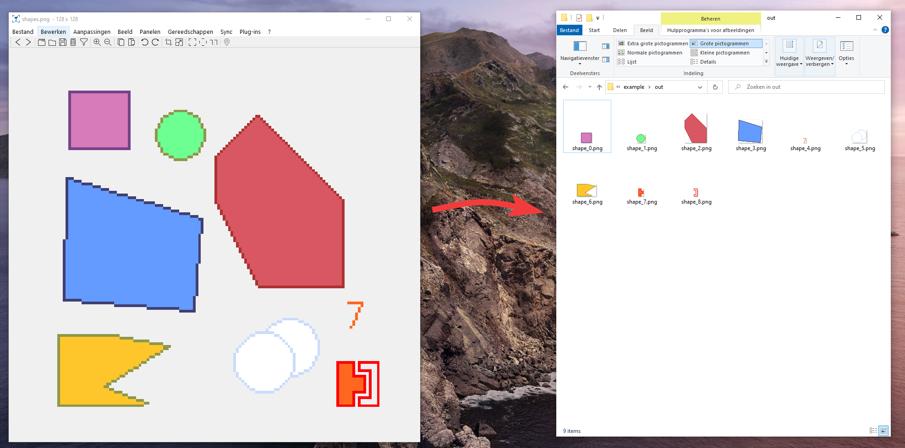

# loose-sprite-unpacker
LooseSpriteUnpacker is a single Java jar that can detect loose sprites in a spritesheet and export them to a target folder, like in the example below:



## Usage
```bash
java -jar loose-unpacker.jar ./spritesheet.png ./output
```

## Installation
Grab the release jar on the right of the screen or compile the program yourself with Eclipse IDE.